# Architecture Diagram

```mermaid
flowchart TB
    user[Client / Consultant] --> api[FastAPI API]

    api --> tenant_loader[Tenant Loader]
    tenant_loader --> local_data[(Local Tenant Data)]
    local_data --> docs[Documents]
    local_data --> feedback[Feedback CSV]
    local_data --> questionnaire[Security Questions]

    api --> rag[RAG Service]
    rag --> chunking[Chunking]
    rag --> embeddings[Local Embeddings]
    rag --> vector[(Local Vector Store)]
    rag --> llm[LLM Provider]

    llm --> mock[Mock Provider]
    llm --> bedrock[Bedrock Provider - Optional]

    api --> agent[Agent Orchestrator]
    agent --> tools[Consulting Tools]
    tools --> knowledge[Knowledge Search]
    tools --> security[Security Questionnaire]
    tools --> feedback_tool[Feedback Analysis]
    tools --> status[Status Report]
    tools --> cost[Cost Estimate]
    tools --> wa[Well-Architected Assessment]

    api --> mcp[MCP-style Interface]
    mcp --> registry[Tool Registry + JSON Schemas]
    mcp --> agent

    subgraph Future AWS Deployment
        s3[(S3 Documents by Tenant)]
        managed_vector[(OpenSearch / pgvector)]
        dynamo[(DynamoDB / RDS Metadata)]
        sqs[SQS Batch Jobs]
        cw[CloudWatch Logs + Metrics]
        secrets[Secrets Manager]
        iam[IAM Least Privilege]
        compute[ECS Fargate / Lambda]
        gateway[API Gateway / CloudFront]
    end

    docs -. future .-> s3
    vector -. future .-> managed_vector
    tenant_loader -. future .-> dynamo
    api -. future .-> compute
    compute -. optional .-> gateway
    api -. observability .-> cw
    api -. secrets .-> secrets
    api -. permissions .-> iam
    rag -. async ingestion .-> sqs
    bedrock -. AWS runtime .-> llm
```

## Notes

- The current project runs locally by default.
- Bedrock is optional and manual.
- The MCP layer is MCP-style for demonstration, not a full official SDK server.
- Future AWS components are intentionally represented as deployment targets, not implemented infrastructure.
