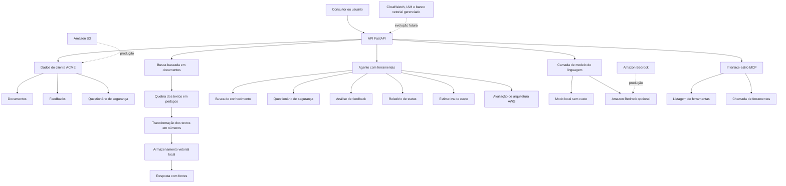

# Diagrama de Arquitetura

## Observações
- O projeto roda localmente por padrão.
- O Amazon Bedrock é opcional e manual.
- O Amazon S3 foi preparado com arquivos de exemplo do cliente.
- A camada MCP é uma demonstração no estilo MCP, não um servidor oficial completo.
- Os demais componentes AWS aparecem como plano de produção, não como infraestrutura já implantada.
